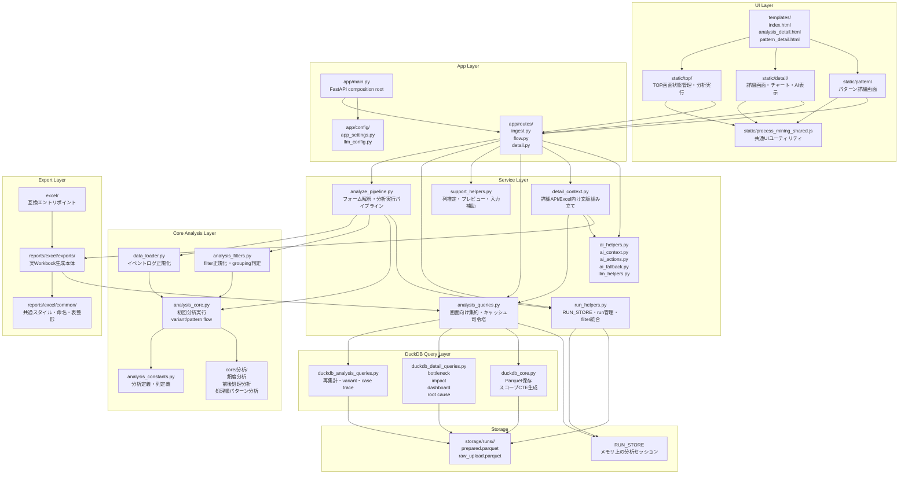
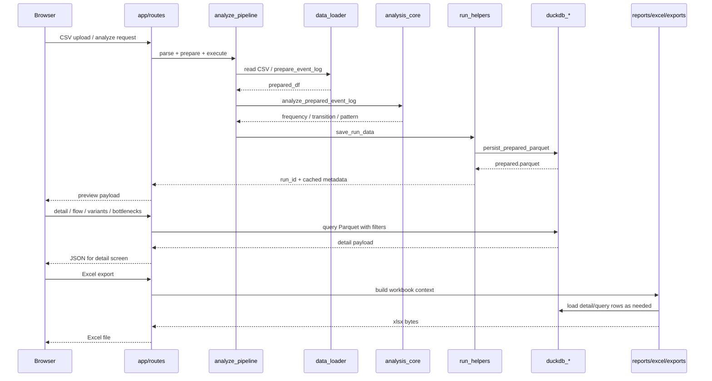

# Process Mining Responsibility Map

## Overview

このプロジェクトは、イベントログを取り込み、

1. pandas で初回分析を作る
2. Parquet に保存する
3. DuckDB で再集計・詳細分析・ドリルダウンを返す
4. 画面表示と Excel レポートへ展開する

という責務分離で構成されている。

## Responsibility Map

## Runtime Flow

## Responsibility Boundaries

- `app/main.py`
  FastAPI の配線担当。実装本体ではなく依存注入ハブ。
- `app/routes/`
  HTTP 入出力担当。基本的に薄い。
- `app/services/`
  画面/API 用の組み立て担当。run 管理、キャッシュ、AI、export context を持つ。
- `core/analysis_*`
  pandas ベースの初回分析担当。
- `core/duckdb_*`
  Parquet を前提にした再集計・詳細クエリ担当。
- `reports/excel/exports/`
  画面表示結果を workbook へ再構成する担当。
- `static/*`
  各画面の状態管理と API 消費担当。

## Important Design Decisions

- 初回分析と再表示クエリを分離している。
- run ごとに Parquet を保存し、詳細画面はそこを読む。
- filter は event-level と case-level を混在運用している。
- AI は補助機能であり、失敗時は rule-based fallback を返す。
- Excel 出力は単表出力ではなく、分析文脈を再構成して複数シートを生成する。
