# Refactor Guide

## Goal

このガイドの目的は、現行機能を壊さずに、今後の改修をしやすい構造へ段階的に移すことである。

このプロジェクトは既に責務分離の方向性を持っているが、実際には以下が変更コストを上げている。

- `app/main.py` に配線が集中している
- `app/services` が application service と query service と cache coordinator を兼務している
- `core` が pandas 分析と DuckDB 再集計の両方を直接公開している
- `excel/` が facade で、実体が `reports/excel/exports/` にあるため追跡しにくい
- run 管理が `RUN_STORE` に集約され、状態管理の境界が曖昧

## Refactor Principles

- まず責務境界を明確にする
- 先に import 方向を整理し、その後にファイル分割する
- pandas 初回分析と DuckDB 再集計を混ぜない
- UI 用の整形とドメイン計算を分ける
- Excel と LLM は adapter として外側に置く
- 挙動変更ではなく、移設と命名整理を優先する

## Target Architecture

```mermaid
flowchart LR
    subgraph Presentation
        P1["routes"]
        P2["templates/static"]
    end

    subgraph Application
        A1["use_cases\nanalyze / export / ai"]
        A2["query_services\ndetail / dashboard / flow"]
        A3["session_store\nrun state"]
        A4["dto / serializers"]
    end

    subgraph Domain
        D1["event_log"]
        D2["analyses\nfrequency / transition / pattern"]
        D3["filters / grouping"]
        D4["flow_model"]
    end

    subgraph Infrastructure
        I1["duckdb repositories"]
        I2["parquet storage"]
        I3["excel report builders"]
        I4["ollama client"]
    end

    Presentation --> Application
    Application --> Domain
    Application --> Infrastructure
    Infrastructure --> Domain
```



## Proposed Package Layout

```text
app/
  bootstrap/
    app_factory.py
    dependencies.py
  routes/
    ingest.py
    detail.py
    flow.py
  use_cases/
    analyze_run.py
    build_detail_view.py
    build_flow_view.py
    export_report.py
    generate_ai_summary.py
  query_services/
    analysis_query_service.py
    dashboard_query_service.py
    flow_query_service.py
  session_store/
    run_session_store.py
  dto/
    analysis_payloads.py
    filter_payloads.py
  config/
    app_settings.py
    llm_config.py

domain/
  event_log/
    loader.py
    schema.py
  analyses/
    frequency.py
    transition.py
    pattern.py
  filters/
    filter_params.py
    grouping.py
  flow/
    process_flow.py
  insights/
    rule_based.py

infrastructure/
  duckdb/
    scoped_query_builder.py
    analysis_repository.py
    detail_repository.py
  storage/
    parquet_store.py
  llm/
    ollama_client.py
  reports/
    excel/
      workbook_builder.py
      sections/
      common/
```

上記は一気に移すための構成ではなく、最終到達点として使う。

## Current Pain Points and Split Strategy

### 1. `app/main.py` が配線と依存選択を抱えすぎている

現状:

- FastAPI 初期化
- template response 互換処理
- route registration
- route へ渡す lambda 群の定義

問題:

- 新しい依存を追加するたびに `main.py` が肥大化する
- テストで route 単位の置換がしにくい
- composition root と use case 選択が混ざっている

分割案:

- `app/main.py`
  最小の起動ファイルにする
- `app/bootstrap/app_factory.py`
  `FastAPI()`、mount、template、router 登録のみを担当
- `app/bootstrap/dependencies.py`
  route に注入する関数束をここで構築する

具体:

- `_template_response` は `app/bootstrap/app_factory.py` へ移す
- `register_*_routes(...)` に渡している lambda 群は `build_ingest_dependencies()`, `build_detail_dependencies()`, `build_flow_dependencies()` へまとめる

### 2. `app/services/analyze_pipeline.py` は use case と validator の混在

現状:

- form 解釈
- file source 解決
- 列解決
- prepared_df 作成
- base filter 適用
- group column 判定
- 初回分析実行
- run 保存

問題:

- 「入力解釈」と「分析実行」が同じファイル
- API 経由以外で再利用しにくい

分割案:

- `app/use_cases/analyze_run.py`
  analyze 実行本体
- `app/dto/analysis_payloads.py`
  form から正規化された request DTO
- `domain/event_log/loader.py`
  CSV から prepared log 生成

第一段階では `parse_analyze_form()` と `execute_analysis_pipeline()` を別モジュールに分けるだけでよい。

### 3. `app/services/run_helpers.py` が state store と filter helper を兼務

現状:

- `RUN_STORE`
- save/load
- filter param normalization の入口
- column settings payload 生成

問題:

- session store と request helper が別責務
- 将来の永続化切替が難しい

分割案:

- `app/session_store/run_session_store.py`
  `RUN_STORE`, `save_run_data`, `get_run_data`, cleanup
- `app/dto/filter_payloads.py`
  filter request / response payload
- `app/use_cases/filter_context.py`
  effective filter merge と summary text

最初に切るべきなのは `RUN_STORE` 周辺で、ここが境界として最も分かりやすい。

### 4. `app/services/analysis_queries.py` が肥大化した query facade

現状:

- analysis 取得
- dashboard / impact / bottleneck
- variant list
- pattern index
- flow snapshot
- cache

問題:

- 1ファイルに画面向け query orchestration が集中
- variant / dashboard / flow で変更理由が別なのに同居している

分割案:

- `app/query_services/analysis_query_service.py`
  `get_analysis_data`, pattern index
- `app/query_services/dashboard_query_service.py`
  dashboard / impact / root cause / insights
- `app/query_services/flow_query_service.py`
  pattern flow / variants / bottlenecks / case drilldown
- `app/session_store/query_cache.py`
  run_data 内 cache key 操作を切り出す

推奨順:

1. flow 系を先に外す
2. dashboard 系を外す
3. pattern index と analysis data を最後に整理する

### 5. `app/services/detail_context.py` は export context builder と API section loader の混在

現状:

- Excel 用 context
- detail API 用 deferred section
- selected transition 解釈

問題:

- Excel の関心と API 応答の関心が異なる
- AI summary の材料組立ても抱えている

分割案:

- `app/use_cases/build_detail_view.py`
  画面向け detail sections 組み立て
- `app/use_cases/export_report.py`
  Excel export context 組み立て
- `app/dto/detail_selection.py`
  selected transition / selected activity / variant selection

### 6. `core` の公開面が広く、分析層と再集計層の境界が曖昧

現状:

- `core.analysis_service` が wildcard export
- pandas 分析 API と DuckDB API が上位から並列に見える

問題:

- 呼び出し側がどこまで domain でどこから infra かを意識しづらい
- import が拡散しやすい

分割案:

- `domain/analyses/*`
  pandas による初回分析
- `infrastructure/duckdb/*`
  Parquet からの query
- `app/use_cases/*`
  両者を束ねる唯一の層

`app/routes` や `reports` から `core/duckdb_*` を直接読む構造は、最終的には `query_services` 経由へ寄せる。

### 7. `reports/excel/exports/*` は機能が強いが境界が深い

現状:

- workbook builder
- section builder
- helper
- pattern 専用 sheet builder

問題:

- export adapter と application context builder が別場所に分かれている
- `excel/` と `reports/excel/exports/` の二重入口で追跡が重い

分割案:

- `infrastructure/reports/excel/workbook_builder.py`
  workbook 全体の組み立て
- `infrastructure/reports/excel/sections/*`
  summary / ai / pattern / bottleneck / impact
- `excel/`
  互換 import 層として残すならコメントを付ける

短期的には、`excel/README` か docstring で「実体は reports 側」と明示するだけでも保守性は上がる。

### 8. AI 関連は整理済みに見えて、実際は helper 集約が強い

現状:

- prompt 生成
- cache
- fallback
- action extraction
- ollama call

問題:

- `ai_helpers.py` が facade として大きい
- prompt policy と transport が同じ文脈に見える

分割案:

- `app/use_cases/generate_ai_summary.py`
  AI summary 生成 orchestration
- `infrastructure/llm/ollama_client.py`
  transport のみ
- `domain/insights/rule_based.py`
  fallback / rule based
- `app/prompting/analysis_prompt_builder.py`
  prompt 組み立て

## File Move Map

### Phase 1: No behavior change, only boundary cleanup

| Current | Move to | Reason |
|---|---|---|
| `app/main.py` | `app/bootstrap/app_factory.py` + `app/bootstrap/dependencies.py` | 配線を分離 |
| `app/services/run_helpers.py` | `app/session_store/run_session_store.py` + `app/dto/filter_payloads.py` | state と request helper を分離 |
| `app/services/detail_context.py` | `app/use_cases/build_detail_view.py` + `app/use_cases/export_report.py` | API と export を分離 |
| `app/services/analysis_queries.py` | `app/query_services/*.py` | query orchestration を分割 |
| `app/services/llm_helpers.py` | `infrastructure/llm/ollama_client.py` | transport を外側へ |

### Phase 2: Domain / Infra separation

| Current | Move to | Reason |
|---|---|---|
| `core/data_loader.py` | `domain/event_log/loader.py` | イベントログ正規化の明示 |
| `core/analysis_filters.py` | `domain/filters/*` | filter と grouping の分離 |
| `core/analysis_flow.py` | `domain/flow/process_flow.py` | flow model を独立 |
| `core/duckdb_core.py` | `infrastructure/duckdb/scoped_query_builder.py` + `parquet_store.py` | query builder と storage を分離 |
| `core/duckdb_analysis_queries.py` | `infrastructure/duckdb/analysis_repository.py` | 再集計 repo |
| `core/duckdb_detail_queries.py` | `infrastructure/duckdb/detail_repository.py` | 詳細 repo |

### Phase 3: Report adapter cleanup

| Current | Move to | Reason |
|---|---|---|
| `reports/excel/exports/detail_report_main.py` | `infrastructure/reports/excel/workbook_builder.py` | workbook 中心へ再編 |
| `reports/excel/exports/detail_report_sections.py` | `infrastructure/reports/excel/sections/*.py` | section 単位で分割 |
| `reports/excel/exports/detail_report_helpers.py` | `infrastructure/reports/excel/helpers.py` | report helper 集約 |

## Recommended Refactor Order

### Step 1

`app/main.py` を薄くする。

理由:

- import 依存の中心だから
- route 単位テストがしやすくなる
- 以後の移設で衝突しにくい

### Step 2

`RUN_STORE` を独立させる。

理由:

- application state の境界が最重要
- query cache や run metadata がここに寄っているため

### Step 3

`analysis_queries.py` を `flow` と `dashboard` と `analysis` に分ける。

理由:

- 変更頻度が高い箇所
- 画面要件追加で最も膨らみやすい

### Step 4

`detail_context.py` を API 用と export 用に分ける。

理由:

- 画面都合と report 都合が衝突しやすい
- Excel 変更が API に波及しなくなる

### Step 5

DuckDB query layer を repository として外出しする。

理由:

- 長期では最も効く
- ただし最初にやると変更範囲が大きい

## Dependency Rules After Refactor

- `routes` は `use_cases` と `query_services` しか参照しない
- `use_cases` は `domain` と `infrastructure` を参照してよい
- `domain` は `app` を参照しない
- `infrastructure` は `domain` を参照してよい
- `reports` は `query_services` か `dto` を受け取り、`routes` を参照しない
- `static` と `templates` は API contract にのみ依存する

## What Not To Do

- 先に class 化だけして責務を曖昧にしない
- pandas と DuckDB の関数を同じ service に戻さない
- `helpers.py` を増やして分割した気にならない
- route から DuckDB query を直接呼ばない
- Excel builder から `run_data` 全体を自由参照させない

## First Practical Refactor Set

最初の実作業としてはこの3つが妥当。

1. `app/main.py` から dependency builder を抜く
2. `app/services/run_helpers.py` から `RUN_STORE` を `run_session_store.py` へ抜く
3. `app/services/analysis_queries.py` から flow 系関数を `flow_query_service.py` へ抜く

この3点だけでも、以後の改修はかなり楽になる。
